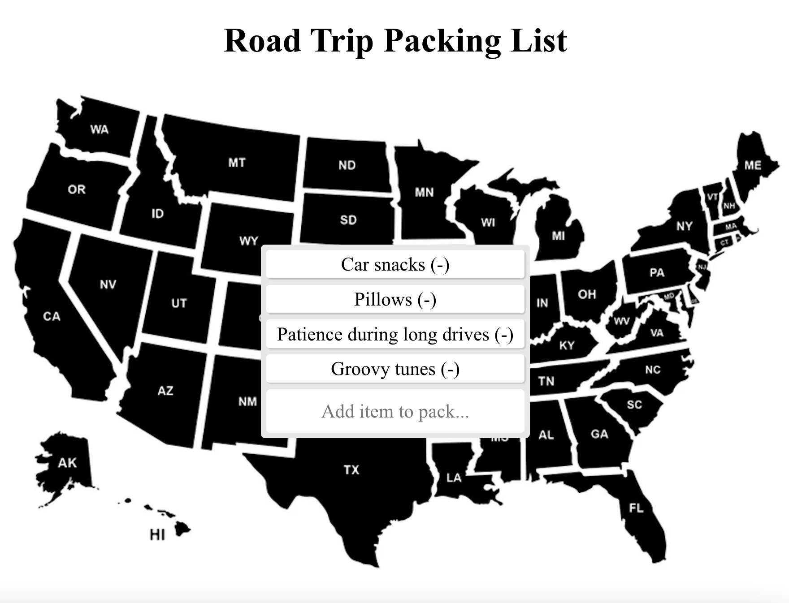

# React To-Do List

 

# About:

 [Click here to see the Road Trip Packing List in action.](https://rainakpuels.github.io/React-To-Do-List)

This is an exercise developed during MIT xPro Full Stack Professional Certificate in Coding.

Using JavaScript,HTML, and CSS I created a simple React to-do list application. 

# How to Run

Download the files.

Run npm install to install the project dependencies.

Run npm start to start the development server.

# Roadmap of Future Improvemenets

No further development is expected.

# Liscence Information 

[MIT License](https://github.com/rainakpuels/React-To-Do-List/blob/default/LICENSE)
